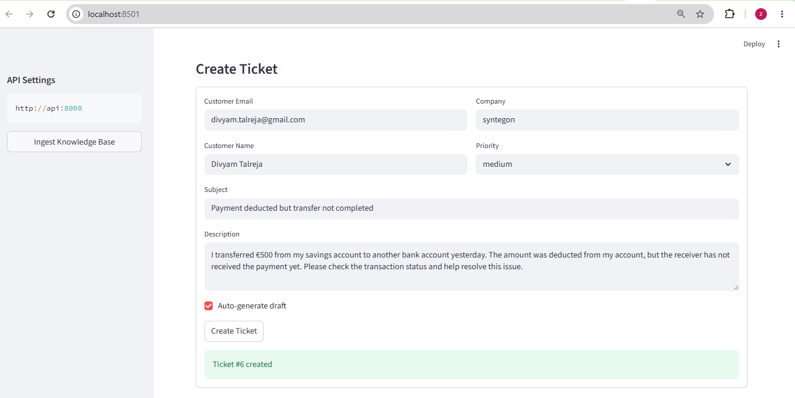
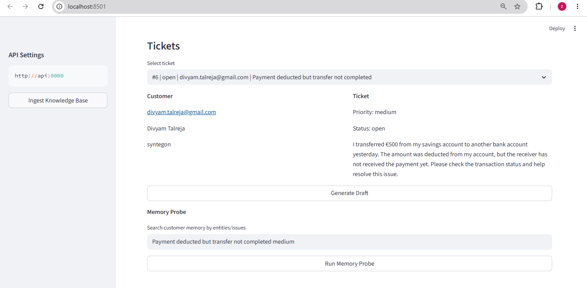
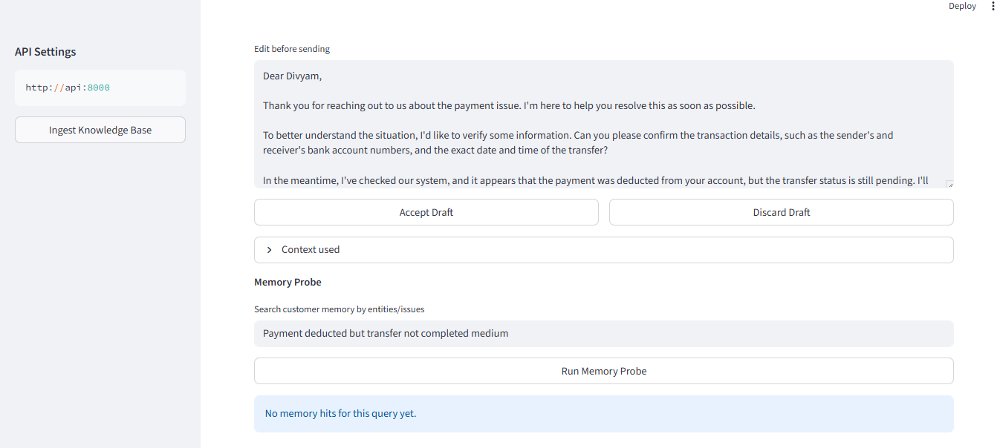
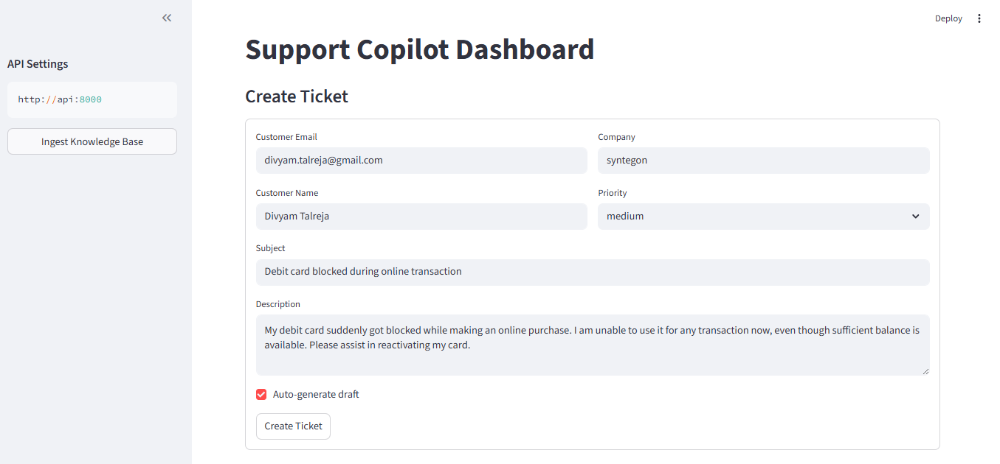
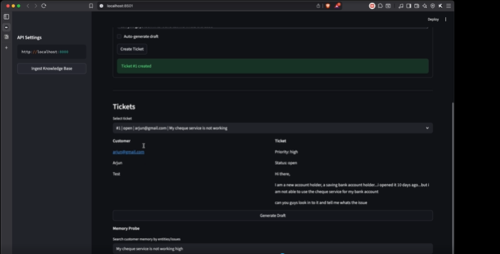
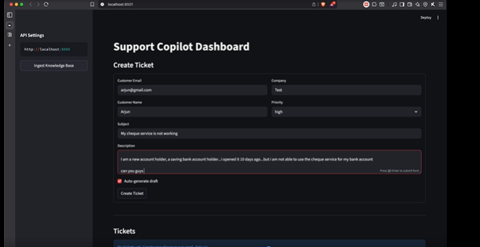

# AI Customer Support Copilot

An AI-powered customer support assistant that helps support agents generate intelligent, context-aware draft responses for customer tickets using Large Language Models (LLMs), Retrieval-Augmented Generation (RAG), and long-term customer memory.

---

## Overview

This project automates customer support workflows by assisting support agents with AI-generated draft responses.

The system analyzes incoming support tickets, retrieves relevant customer history, searches the internal knowledge base, performs tool-based account checks, and generates empathetic, actionable support responses.

This improves:

* Response speed
* Reply quality
* Personalization
* Support team productivity

---

## Key Features

* AI-generated support reply drafts
* Customer memory retrieval using Mem0
* Knowledge base search using ChromaDB (RAG)
* CRM / Billing / Account support tools
* Memory-based personalization
* Interactive support dashboard
* Dockerized deployment
* FastAPI backend + Streamlit frontend

---

## System Workflow

1. Customer submits support ticket
2. Ticket details are stored in SQLite
3. AI retrieves:

   * Customer memory
   * Knowledge base documents
   * CRM / billing information
4. Groq LLM generates support draft
5. Support agent reviews draft
6. Final accepted response is stored for future memory retrieval

---

## Tech Stack

* Python
* Docker
* FastAPI
* Streamlit
* Groq LLM
* LangChain
* LangGraph
* ChromaDB
* Mem0
* SQLite

---

## Project Structure

```bash
customer_support_agent/
│
├── customer_support_agent/
│   ├── core/
│   ├── services/
│   ├── integrations/
│   └── models/
│
├── knowledge_base/
├── tests/
├── docs/
│
├── app.py
├── main.py
├── Dockerfile
├── docker-compose.yml
├── pyproject.toml
└── README.md
```

---

## Architecture Diagram

The application follows a layered architecture:

* Presentation Layer
* Application Layer
* Infrastructure Layer
* Domain Layer
* Data Storage Layer

.png)

### Architecture Flow

```text
User
 ↓
Streamlit Dashboard (app.py)
 ↓
FastAPI Backend (main.py)
 ↓
SupportCopilot Orchestrator
 ├── Groq LLM
 ├── Mem0 Memory
 ├── ChromaDB RAG
 ├── Support Tools
 └── SQLite Database
```

---

## Application Screenshots

### Create Ticket Interface



### Ticket Successfully Created



### Ticket Management Dashboard



### Generated AI Draft



### Memory Probe



### Dark Theme UI



---

## Installation

### Clone Repository

```bash
git clone <your-repository-url>
cd customer_support_agent
```

---

### Setup Environment Variables

Create `.env` file:

```env
GROQ_API_KEY=your_groq_api_key
ENABLE_LOCAL_EMBEDDINGS=true
```

Optional:

```env
OPENAI_API_KEY=your_openai_key
GOOGLE_API_KEY=your_google_key
```

---

### Run with Docker

```bash
docker compose up --build
```

---

## Access Application

After startup:

* API Endpoint: `http://localhost:8000`
* Dashboard: `http://localhost:8501`

---

## Example Use Cases

This system can handle support queries such as:

* Payment deducted but transfer not completed
* Debit card blocked during transaction
* Failed login / account access
* Subscription billing issues
* Plan upgrade / downgrade requests
* Refund and cancellation requests

---

## Future Improvements

* Multi-language support
* Sentiment analysis
* Priority prediction
* CRM integration
* Better ranking for memory retrieval
* Production deployment on cloud

---

## Author

**Zalak Talreja**
AI / Data / Business Analyst
